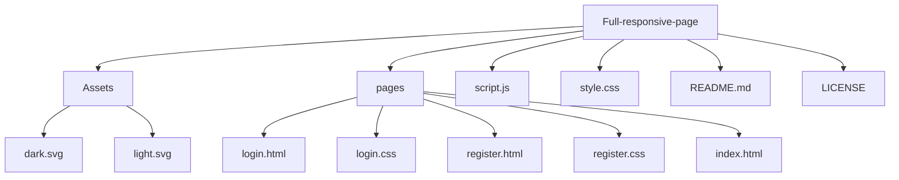

<h1 align="center">🌐 Full Responsive Web Page</h1>

<p align="center">
  
  
</p>

<p align="center">
  A sleek and modern responsive web page designed to adapt seamlessly across various devices and screen sizes.
</p>

---

## 📋 Table of Contents

- [📋 Table of Contents](#-table-of-contents)
- [✨ Features](#-features)
- [🛠️ Installation](#️-installation)
- [🚀 Technologies Used](#-technologies-used)
- [📂 Project Structure](#-project-structure)
- [🤝 Contributing](#-contributing)
- [📄 License](#-license)
- [📞 Contact](#-contact)

---

## ✨ Features

- **Responsive Design:** Ensures optimal viewing experience on desktops, tablets, and mobile devices.
- **Modern Layout:** Utilizes contemporary design principles for a clean and intuitive interface.
- **Cross-Browser Compatibility:** Functions flawlessly across major web browsers.
- **Performance Optimized:** Efficient code and assets for fast load times.

---


## 🛠️ Installation

To set up the project locally:

1. **Clone the repository:**

```bash
   git clone https://github.com/EpicFailure-afk/Full-responsive-page.git

```

---

2. **Navigate to the project directory:**

```bash
cd Full-responsive-page
```

---

## 🚀 Technologies Used  

This project was built using:  

- **HTML5** – Structuring the content  
- **CSS3** – Styling and responsive design  
- **JavaScript** – Adding interactivity  
- **Flexbox & Grid** – Ensuring a fluid layout  
- **Media Queries** – Optimizing responsiveness  
- **Google Fonts** – Enhancing typography  
- **Font Awesome** – Adding icons  


---


## 📂 Project Structure



---

## 🤝 Contributing
> Contributions are welcome! To contribute:

1. **Fork the repository.**

2. **Create a new branch:**

```bash
git checkout -b feature/YourFeatureName
```

3. **Commit your changes:**

```bash
git commit -m 'Add some feature'
```

4. **Push to the branch:**
```bash
git push origin feature/YourFeatureName
```

5. **Open a pull request.**


---

## 📄 License

This project is licensed under the **MIT License**. See the [LICENSE](LICENSE) file for details.

---

## 📞 Contact  

For questions or feedback, reach out:  

- **Name**: Ahmed Salah  
- **GitHub**: [EpicFailure-afk](https://github.com/EpicFailure-afk)  
- **LinkedIn**: [Ahmed Salah](https://www.linkedin.com/in/ahmed-salah-000517351/)  


